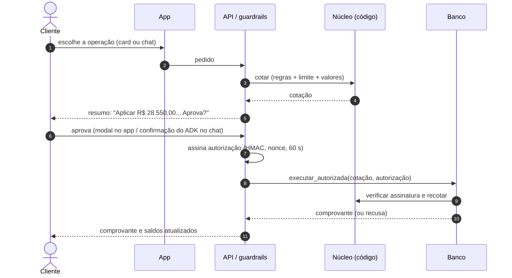

# Decisões de Arquitetura (ADRs)

> **Sistema:** Aplicaí
> **Base:** Google ADK 2.x, Gemini, Cloud Run
> **Regra que organiza tudo:** a IA conversa, o código calcula e o cliente aprova.
> Visão completa da arquitetura, dos guardrails e da jornada em `ARQUITETURA_GCP_GUARDRAILS_E_JORNADA.md`.

---

## Índice

- [ADR 001: Projeção de 30 dias e reserva das contas antes de qualquer oferta](#adr-001)
- [ADR 002: O código calcula; o modelo explica](#adr-002)
- [ADR 003: Cotação, aprovação do cliente e autorização assinada](#adr-003)
- [ADR 004: Um único produto de investimento e perfil de investidor obrigatório](#adr-004)
- [ADR 005: Modelos, raciocínio baixo e custo por conversa](#adr-005)
- [ADR 006: Cards na tela inicial, chat sob demanda](#adr-006)
- [ADR 007: Banco exposto por MCP](#adr-007)

---

### ADR 001: Projeção de 30 dias e reserva das contas antes de qualquer oferta

**Status:** implementado (`gestor_caixa/motor_projecao.py`, `gestor_caixa/portao_risco.py`)

**Contexto.** Na base do evento, 50,7% dos clientes ganham mais do que gastam e 49,3% gastam mais do que ganham; 32,7% entraram no cheque especial em 2025. O mesmo cliente oscila ao longo do mês: salário, depois financiamento e escola, depois a fatura. Um robô de investimento que olha só o saldo de hoje sugere aplicar dinheiro que vai fazer falta no dia 8.

**Decisão.** Toda decisão parte de uma projeção dos próximos 30 dias, em código:

1. identificar as contas previstas na janela (saídas cadastradas e a fatura em aberto), com os prazos vindos dos próprios dados;
2. reservar a soma dessas contas mais 15% da renda para o dia a dia;
3. classificar o cliente (`endividado`, `falta_prevista`, `equilibrado`, `sobra_para_investir`) e calcular o que sobra;
4. só então decidir o que o app mostra: oferta de investimento, pedido de atualização de perfil, opções para a fatura ou acolhimento.

A reserva é conservadora de propósito: não conta com o salário que ainda não caiu. É melhor sugerir investir um pouco menos do que deixar faltar para uma conta; o CDB tem liquidez diária, então o cliente resgata se precisar.

**Consequências.** Nenhum cliente recebe oferta de aplicação por um valor que comprometa as contas do mês (testado). O que fica para produção: sincronizar a lista de contas com os débitos automáticos reais do banco, em vez do cadastro do cliente simulado.

---

### ADR 002: O código calcula; o modelo explica

**Status:** implementado (`copiloto_fatura/tools/simulador.py`, `gestor_caixa/simulador_liquidez.py`)

**Contexto.** Modelos de linguagem erram aritmética, arredondam de forma imprevisível e dão respostas diferentes para a mesma pergunta. Juros compostos, tabela Price, CET, IOF regressivo e IR regressivo não admitem isso.

**Decisão.** O modelo **nunca calcula**. Toda matemática está em funções Python puras:

- fatura: pagamento mínimo, rotativo por 30 dias mais parcelamento obrigatório, Price para 3/6/12x, crédito pessoal, pagamento parcial, CET por bisseção, IOF de crédito, teto de 100% da dívida (Lei 14.690/2023);
- investimento: CDI por dia útil (252/365), IOF regressivo do 1º ao 29º dia (Decreto 6.306/2007), IR regressivo (22,5% a 15%).

O modelo recebe os resultados prontos pelas ferramentas do ADK e só escolhe o que perguntar e como explicar. O diagnóstico também é código, não um terceiro agente: um agente só para calcular somaria chamadas e custo sem somar qualidade.

**Consequências.** Mesma entrada, mesmo resultado, auditável e testado com valores conhecidos (31 testes só de matemática). Os retornos das ferramentas precisam ser compactos, porque voltam ao modelo em todo turno seguinte.

---

### ADR 003: Cotação, aprovação do cliente e autorização assinada

**Status:** implementado (`copiloto_fatura/guardrails.py`, `copiloto_fatura/autorizacao.py`, `mock_core/store.py`)

**Contexto.** Um agente que movimenta dinheiro está exposto a três falhas: executar algo que o cliente não pediu (por manipulação do modelo ou por argumento inventado), executar duas vezes (repetição da chamada) e executar com valores diferentes dos que o cliente viu.

**Decisão.** Toda operação (pagar, parcelar, aplicar, resgatar) segue o mesmo caminho, seja pelo chat, pelo card do app ou pelo MCP:

1. **Cotar:** o código calcula exatamente o que vai acontecer, com os dados atuais do banco. As regras de elegibilidade e o limite da sobra rodam **dentro da cotação**; se a operação não é permitida, para aqui.
2. **Aprovar:** o cliente vê um resumo gerado da cotação (não pelo modelo) e aprova. No chat, é o pedido de confirmação nativo do ADK, um evento fora do texto; escrever "sim" não aprova nada. No app, é o modal de autenticação. A aprovação vale 5 minutos, para aquela cotação, uma vez.
3. **Autorizar:** o sistema emite uma autorização assinada (HMAC-SHA256) com a cotação, um nonce e validade de 60 segundos. O modelo nunca a vê; uma "autorização" enviada pelo modelo é descartada.
4. **Executar:** o banco confere a assinatura, a validade, a operação, o cliente e os parâmetros, **recalcula a cotação** e só executa se nada mudou. A mesma autorização, ou a mesma operação no mesmo ciclo da fatura, devolve o comprovante original sem debitar de novo.

**Consequências.** Sem autorização válida nada executa, mesmo que um guardrail seja removido por engano: a defesa está no banco, não só no agente. Testado contra autorização forjada, adulterada, expirada, reutilizada e para outro cliente ou parâmetro, inclusive pelo caminho MCP real. No protótipo, a identidade do cliente é simulada (`iniciar_atendimento` e o `cliente_id` no corpo da requisição do app); em produção ela vem do token do canal, validado no gateway.

---

### ADR 004: Um único produto de investimento e perfil de investidor obrigatório

**Status:** implementado (`gestor_caixa/portao_risco.py`, `data/gerar_dataset.py`)

**Contexto.** O dinheiro que o Aplicaí sugere aplicar é a sobra da conta corrente, que o cliente pode precisar no mês seguinte. E oferecer investimento exige adequação ao perfil do cliente.

**Decisão.** O único produto oferecido é o CDB de liquidez diária, 100% do CDI, com garantia do FGC: o mais conservador, adequado a qualquer perfil. Antes da oferta, cinco regras em código, nesta ordem: saldo negativo; endividado (negativado ou 3+ meses no rotativo em 12); falta prevista para as contas do mês; sobra insuficiente (menos de R$ 2.000 ou saldo abaixo de R$ 5.000); **perfil de investidor ausente ou vencido**. Sem perfil válido, o app pede a atualização em vez de ofertar, e a aplicação é recusada também na execução. O valor aplicado nunca passa da sobra do mês.

É uma política interna **inspirada** na Resolução CVM 30 e na Lei 14.181/2021, não uma certificação de conformidade.

**Consequências.** A escolha é de produto, não de público: liquidez diária é requisito, porque o dinheiro pode fazer falta. Com a adequação ao perfil completa, o mesmo núcleo passa a oferecer produtos de outros perfis. Cada recusa tem um código e uma explicação em português, o que atende à explicabilidade de decisões automatizadas (LGPD, art. 20).

---

### ADR 005: Modelos, raciocínio baixo e custo por conversa

**Status:** implementado (`copiloto_fatura/agent.py`, `copiloto_fatura/demo_llm.py`)

**Contexto.** O modelo só conversa e escolhe ferramentas; a qualidade dos números vem do código. Um modelo grande aumentaria custo e latência sem melhorar o resultado.

**Decisão.**

- **Modelo:** `gemini-3.8-flash` por padrão (`COPILOTO_MODEL`), pela Gemini API ou pelo Vertex AI (`GOOGLE_GENAI_USE_ENTERPRISE=1`), sem mudar código.
- **Raciocínio:** nível baixo por padrão (`COPILOTO_THINKING=low`), porque tokens de raciocínio contam na cota e as decisões do modelo aqui são simples (qual ferramenta chamar, como explicar).
- **Agente de ações:** pode usar um modelo mais leve (`COPILOTO_MODEL_ACAO`); por padrão usa o mesmo da conversa.
- **Plano B:** `COPILOTO_MODEL=demo` substitui o Gemini por um roteiro, sem internet e sem cota. Cobre a jornada da fatura; a jornada de investimento no app não depende do modelo (os cards são código).

**Consequências.** Medido na avaliação (`eval_resultados.md`): cerca de 7,6 mil tokens de entrada e 500 de saída por conversa completa da fatura; um ataque de injeção custa zero, porque o guardrail responde antes do modelo. Latência e custo em escala não foram medidos em carga; ficam para o piloto.

---

### ADR 006: Cards na tela inicial, chat sob demanda

**Status:** implementado (`web/servidor.py`, `web/static/index.html`)

**Contexto.** Ninguém quer digitar num chat para saber se pode aplicar R$ 1.000. A decisão precisa aparecer no momento certo, com a ação pronta.

**Decisão.** A tela inicial mostra um card calculado em código para a situação do cliente: aplicar a sobra (um toque), atualizar o perfil de investidor, proteger a fatura contra o rotativo ou falar com uma pessoa. O chat com o Aplicaí abre sob demanda, para quem quer entender o cálculo, simular ou perguntar sobre regras. O card e o chat usam as mesmas ferramentas e passam pelo mesmo caminho de aprovação.

**Consequências.** A demo principal (Diego) não depende do modelo. O chat continua necessário para a jornada da fatura, em que a conversa importa (o cliente escolhe entre opções e pode precisar de acolhimento).

---

### ADR 007: Banco exposto por MCP

**Status:** implementado (`mock_core/server.py`, `COPILOTO_USE_MCP=1`)

**Contexto.** Acoplar o agente diretamente ao sistema que executa operações dificulta trocar o sistema e testar a fronteira entre os dois.

**Decisão.** O banco simulado também é exposto por um servidor MCP (transporte `stdio`). Com `COPILOTO_USE_MCP=1`, as ferramentas de operação do agente passam pelo protocolo. A autorização assinada atravessa a fronteira e é conferida do outro lado; a chave de assinatura chega ao processo MCP pelo ambiente, nunca pelo modelo.

**Consequências.** A mesma inteligência conecta a outro provedor sem reescrever o agente. O processo MCP tem a própria cópia do banco simulado; em produção, os dois lados apontam para o mesmo sistema. Há um teste de integração que sobe o servidor por `stdio` e confere a recusa sem autorização.
