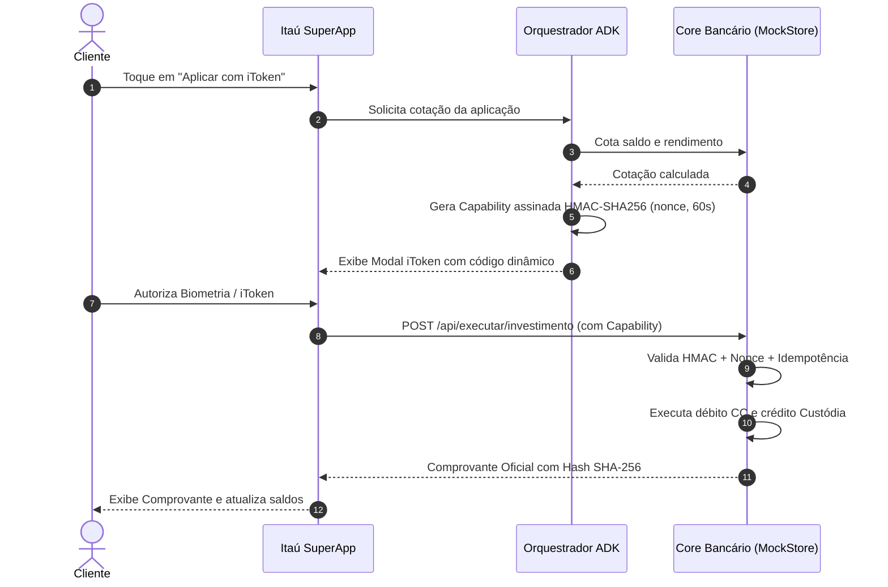

# Decisões de Arquitetura de Software (ADRs)

> **Documento Oficial de Engenharia & Arquitetura de Solução**  
> **Sistema:** Itaú Gestor de Liquidez & Investimentos com IA (Cash Sweeper)  
> **Framework Base:** Google ADK 2.x (Agent Development Kit)  
> **Padrão de Governança:** Zero-Trust Financial Computing & Zero-LLM Math

---

## Índice de Decisões Arquiteturais (ADRs)

- [ADR 001: Arquitetura Biphasic (Colchão Dinâmico + Cash Sweeper)](#adr-001-arquitetura-biphasic-colchão-dinâmico--cash-sweeper)
- [ADR 002: Separação Estrita entre Computação Determinística e Modelos Generativos](#adr-002-separação-estrita-entre-computação-determinística-e-modelos-generativos)
- [ADR 003: Protocolo 2-Phase Commit com Capability Criptográfica HMAC-SHA256](#adr-003-protocolo-2-phase-commit-com-capability-criptográfica-hmac-sha256)
- [ADR 004: Seleção de Modelos e Unit Economics de Inferência](#adr-004-seleção-de-modelos-e-unit-economics-de-inferência)
- [ADR 005: Experiência Mobile Action-First com Smart Cards Nativos](#adr-005-experiência-mobile-action-first-com-smart-cards-nativos)
- [ADR 006: Protocolo Model Context Protocol (MCP) para Desacoplamento do Core](#adr-006-protocolo-model-context-protocol-mcp-para-desacoplamento-do-core)

---

### ADR 001: Arquitetura Biphasic (Colchão Dinâmico + Cash Sweeper)

#### Status
**Aprovado e Implementado**

#### Contexto
A literatura tradicional de agentes de investimento para varejo costuma sugerir chatbots consultivos que perguntam o perfil de risco do cliente (suitability) e recomendam ativos de prateleira (CDBs, fundos, ações).  
Ao analisar a base real de correntistas no BigQuery (`hackathon_dados.extrato_sintetico`), constatamos que **49,3% dos clientes gastam mais do que ganham e 32,7% entraram no cheque especial em 2025**, enquanto os outros **50,7% têm sobra mensal que fica parada na conta**. Um cliente oscila entre esses estados ao longo do mês: recebe o salário, tem débitos fixos como financiamento e escola logo em seguida e, depois, a fatura do cartão.

#### Decisão
Adotamos uma **Arquitetura Biphasic**:
1. **Fase 1 (Colchão de Liquidez Dinâmico):** Antes de qualquer recomendação de aplicação, o motor determinístico projeta o fluxo de 30 dias e reserva 100% dos débitos fixos conhecidos (financiamento, contas de consumo, fatura em aberto) somados a uma margem de segurança para despesas essenciais do dia a dia (15% da renda).
2. **Fase 2 (Cash Sweeping ou Proteção de Passivo):**
   - Se houver excedente livre após o colchão $\rightarrow$ Aciona o **Sweeper de Liquidez**, recomendando aplicação no CDB 100% CDI com resgate diário.
   - Se o saldo projetado for insuficiente para honrar a fatura $\rightarrow$ Bloqueia aplicações e aciona o **Escudo Anti-Rotativo**, recomendando parcelamento planejado para estancar juros de 14,9% a.m.

#### Consequências
- **Positivas:** Compliance total com o dever fiduciário bancário. Zero risco de um cliente aplicar dinheiro e ter seu financiamento habitacional rejeitado por falta de fundos.
- **Negativas:** Exige sincronização contínua com agendamentos de débito automático do core banking.

---

### ADR 002: Separação Estrita entre Computação Determinística e Modelos Generativos

#### Status
**Aprovado e Implementado**

#### Contexto
Modelos de linguagem (LLMs) são probabilísticos e sujeitos a alucinações aritméticas, arredondamentos imprecisos e variabilidade não determinística em cálculos financeiros complexos (como juros compostos, IOF regressivo em dias úteis e tabela Price). No setor bancário, um erro de 1 centavo em cálculo de juros ou cotação invalida a operação perante a auditoria do Banco Central.

#### Decisão
Implementamos a regra de **Zero-LLM Math**:
- **A LLM NUNCA calcula:** Alíquotas de IOF, IR, taxas CDI, parcelas de financiamento ou saldos remanescentes.
- **Toda matemática reside em módulos Python puros e determinísticos:**
  - `gestor_caixa/simulador_liquidez.py`: CDI exato (252 dias úteis), IOF regressivo de 1 a 29 dias conforme Decreto 6.306/2007 e IR regressivo.
  - `copiloto_fatura/tools/simulador.py`: Tabela Price para parcelamento de faturas, CET e IOF de crédito.
- O LLM atua estritamente como **orquestrador semântico e comunicador empático**, recebendo os resultados calculados e formatados via Tool Calls tipadas do ADK.

#### Consequências
- **Positivas:** 100% de precisão e auditabilidade matemática. Testabilidade unitária completa (156 testes automatizados com tempo de execução < 10 segundos).
- **Negativas:** A interface de ferramentas (tool schemas) deve ser estritamente tipada com Pydantic v2.

---

### ADR 003: Protocolo 2-Phase Commit com Capability Criptográfica HMAC-SHA256

#### Status
**Aprovado e Implementado**

#### Contexto
Agentes autônomos que realizam mutação de estado financeiro (transferências, aplicações, contratações de crédito) são vulneráveis a ataques de *Prompt Injection*, repetição não intencional de chamadas (*Double Spending* por repetição de tool call) e alucinações de argumentos.

#### Decisão
Implementamos o padrão de **2-Phase Commit com Capability Assinada**:
1. **Fase de Cotação:** A ação gera uma cotação com base no estado atual do core. O host emite uma *Capability* assinada digitalmente com HMAC-SHA256 contendo o payload da cotação, um nonce aleatório e validade de 60 segundos.
2. **Fase de Autenticação do Cliente:** O cliente aprova a operação visualmente através do modal oficial do **iToken Itaú** (seja via botão de 1 toque no Smart Card ou via ToolConfirmation no chat).
3. **Fase de Execução (Core Bancário):** O core recebe a capability, valida a assinatura criptográfica, verifica a validade temporal de 60s e confere se a cotação mudou. Se a mesma capability for apresentada novamente, o core atua de forma idempotente, devolvendo o recibo anterior (*replay*) sem debitar o cliente duas vezes.

---

### ADR 004: Seleção de Modelos e Unit Economics de Inferência

#### Status
**Aprovado e Implementado**

#### Contexto
A arquitetura deve suportar milhões de correntistas no Itaú SuperApp com latência imperceptível (< 1,5s) e viabilidade econômica em escala. Modelos ultra-pesados aumentam o custo e o tempo de resposta desnecessariamente para diálogos de apoio financeiro.

#### Decisão
- **Modelo Principal:** **Google Gemini 2.5 Flash** (ou `gemini-3.8-flash` via Google ADK).
  - Raciocínio rápido (*low thinking*) para inferência de intenção e tool selection.
  - Custo médio estimado: ~$0.00035 por interação completa (minimizando tokens via prompts enxutos).
- **Modelo para Agente de Ação / Execução:** **Gemini Flash Lite**, com instruções ultracompactas focadas apenas no fechamento da transação.
- **Plano B de Continuidade de Negócio (Fallback):** Módulo `demo_llm.py` para operação em contingência sem conectividade externa ou esgotamento de quota.

---

### ADR 005: Experiência Mobile Action-First com Smart Cards Nativos

#### Status
**Aprovado e Implementado**

#### Contexto
Usuários de banco de varejo não utilizam caixas de diálogo conversacionais para tarefas operacionais cotidianas (como checar saldo, pagar fatura ou aplicar excedente). Forçar o usuário a "bater papo" para investir adiciona atrito cognitivo severo e derruba o funil de conversão.

#### Decisão
Invertemos o paradigma de "Chat-First" para **"Action-First com IA On-Demand"**:
- **Smart Cards Proativos na Home:** O aplicativo expõe as oportunidades financeiras calculadas pelo agente diretamente na tela inicial da conta (ex: *"Você possui R$ 28.550 parados a 0%. Aplicar com iToken"*).
- **Ação em 1 Toque:** O usuário pode efetivar a decisão sem digitar uma única palavra.
- **Copiloto Conversacional Sob Demanda (Drawer Lateral):** O assistente IA.Í fica acessível via botão flutuante para clientes que desejam aprofundar, simular cenários futuros ou tirar dúvidas em linguagem natural.

---

### ADR 006: Protocolo Model Context Protocol (MCP) para Desacoplamento do Core

#### Status
**Aprovado e Implementado**

#### Contexto
Em ambientes bancários legados, acoplar o agente diretamente aos microsserviços de mensageria mainframe e core bancário gera fragilidade e risco de segurança.

#### Decisão
Adotamos o padrão aberto **Model Context Protocol (MCP)**:
- O core bancário é exposto através de um servidor MCP (`mock_core/server.py`), operando via transporte padronizado `stdio` ou SSE.
- O agente consome ferramentas através do MCP Toolset do Google ADK (`COPILOTO_USE_MCP=1`), garantindo que a mesma inteligência possa ser conectada a diferentes provedores bancários sem reescrita de código.
