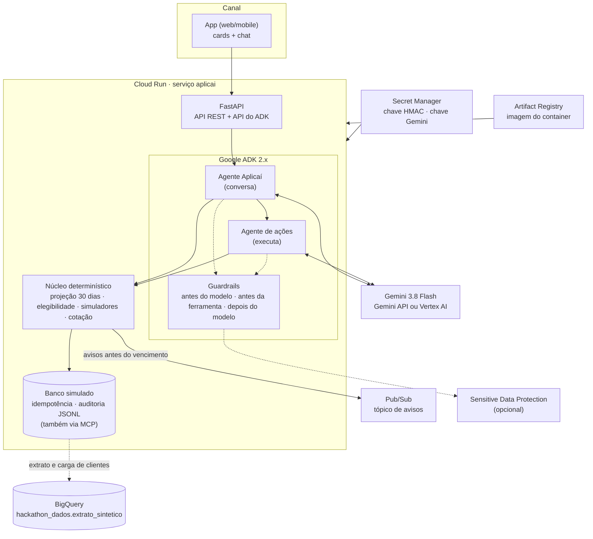
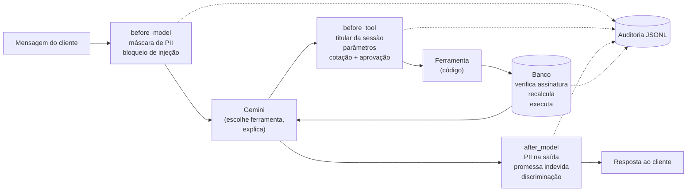
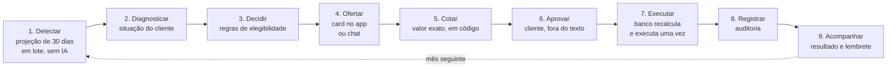
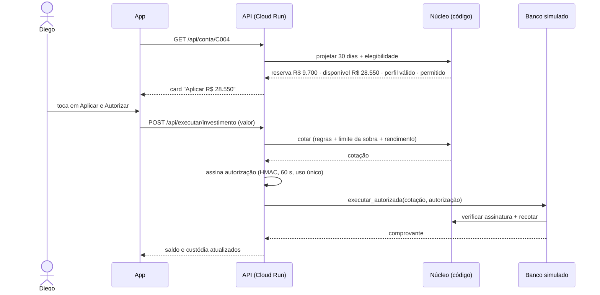
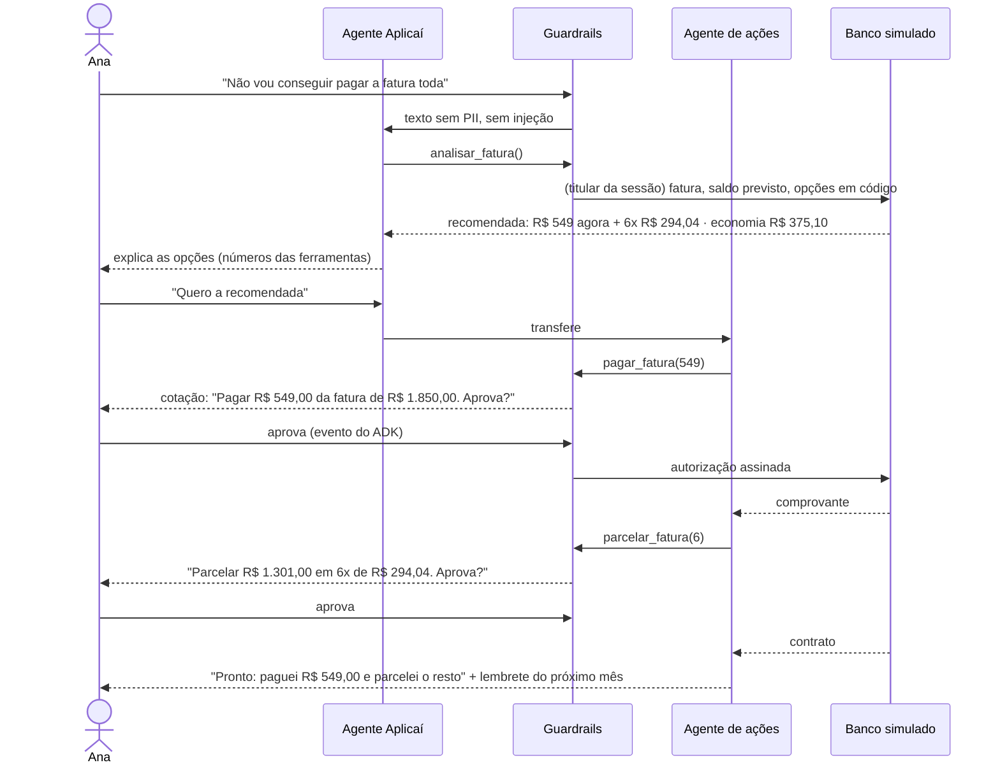

# Aplicaí: arquitetura no Google Cloud, guardrails e fluxo da jornada

> Documento de referência para a banca. Três perguntas, três seções:
> **por que cada peça do GCP está onde está**, **por que cada guardrail existe e como se prova que funciona**,
> e **o que acontece, passo a passo, quando um cliente usa o Aplicaí**.
> Tudo o que está aqui existe no código e é coberto por testes, salvo onde marcado como *evolução*.

---

## 1. Arquitetura no Google Cloud

### 1.1 Visão geral



### 1.2 Cada escolha e o porquê

| Serviço | Papel no Aplicaí | Por que essa escolha | Onde está |
| --- | --- | --- | --- |
| **Cloud Run** | Hospeda a API, os agentes, o núcleo e o banco simulado num único container | Sem servidor para gerenciar, escala a zero (custo zero fora da demo), deploy por imagem, e é onde o ADK roda sem adaptação. Um único serviço mantém o protótipo simples; em produção, núcleo e banco viram serviços próprios. | `Dockerfile`, `scripts/deploy_cloud_run.sh` |
| **Google ADK 2.x** | Orquestra os dois agentes, as ferramentas, o estado da sessão e o **pedido de confirmação nativo** usado na aprovação | O fluxo de aprovação (`request_confirmation`) é o que permite pausar a execução e pedir o "sim" fora do texto do modelo. Os callbacks (`before_model`, `before_tool`, `after_model`) são o ponto de encaixe dos guardrails sem depender do prompt. | `copiloto_fatura/agent.py`, `guardrails.py` |
| **Gemini 3.8 Flash** | Conversa, escolhe a ferramenta e explica os números | Modelo rápido e barato para um caso em que o modelo **não calcula nem executa**: a qualidade vem do núcleo, e o modelo precisa só entender e explicar. Raciocínio em nível baixo por padrão (`COPILOTO_THINKING=low`), porque tokens de raciocínio contam na cota. Funciona pela Gemini API (chave) ou pelo Vertex AI (`GOOGLE_GENAI_USE_ENTERPRISE=1`), sem mudar código. | `.env.example`, `agent.py` |
| **BigQuery** | Fonte da base do evento: análise exploratória, carga dos clientes sintéticos e consulta de extrato | É onde a base foi entregue. A análise que sustenta o pitch (49,3% / 50,7% / 32,7%) saiu de consultas SQL; a carga em lote transforma a tabela no formato do banco simulado; e `consultar_extrato_detalhado` lê direto quando `COPILOTO_USE_BIGQUERY=1`. Fora do BigQuery, tudo funciona com o JSON local. | `scripts/carregar_dados_extrato_sintetico.py`, `proativo/gcp_adapters.py`, `docs/analise_dados_extrato_sintetico.md` |
| **Pub/Sub** | Fila dos avisos antes do vencimento, com atributos de roteamento (cliente, prioridade, canal) | Desacopla a **detecção** (em lote, em código, sem modelo) do **envio** (app, WhatsApp, voz), que é outro sistema. A rotina roda sem o tópico configurado; com ele, publica. | `proativo/gatilho.py`, `proativo/gcp_adapters.py`, `scripts/setup_gcp_resources.sh` |
| **Secret Manager** | Guarda a chave HMAC que assina as autorizações e a chave do Gemini; o Cloud Run monta como variável | A chave HMAC é o que impede o modelo (ou qualquer chamada) de forjar uma autorização. Ela nunca vai para o repositório nem para o cliente. Sem o segredo configurado, o processo gera uma chave aleatória por execução. | `scripts/setup_gcp_resources.sh`, `deploy_cloud_run.sh` |
| **Sensitive Data Protection (Cloud DLP)** | Detecção gerenciada de dados pessoais nos guardrails, opcional | Os padrões locais (regex) cobrem CPF, cartão, telefone, e-mail, conta, endereço; o serviço gerenciado amplia a cobertura (nomes, endereços livres). Ligado por `COPILOTO_USE_CLOUD_DLP=1`, com **fallback transparente** para os padrões locais se falhar. | `copiloto_fatura/dlp_adapter.py` |
| **Artifact Registry** | Imagem do container versionada | Padrão do Cloud Run; permite voltar a uma versão anterior. | `deploy_cloud_run.sh` |
| **MCP (protocolo aberto)** | O banco simulado também é exposto por MCP; as ferramentas de operação podem ir por ele (`COPILOTO_USE_MCP=1`) | Mostra que o agente não depende de importar o banco: a mesma autorização assinada é conferida do outro lado do protocolo. | `mock_core/server.py` |

### 1.3 O que é opcional, o que é evolução

| Item | Estado | Comentário |
| --- | --- | --- |
| Cloud DLP, Pub/Sub, BigQuery | **Opcionais, com fallback** | Desligados, o sistema roda 100% local; os testes cobrem os dois modos |
| Modo `demo` (`COPILOTO_MODEL=demo`) | **Funciona** | Substitui o Gemini por um roteiro; cobre a jornada da fatura, não a de investimento |
| Vertex AI Embeddings na busca de normas | Opcional, não instalado | A busca de normas roda por palavras-chave; embeddings entrariam para uma base maior |
| Agent Engine / Agent Runtime | *Evolução* | Hoje os agentes rodam dentro do Cloud Run; o Agent Engine traria sessões e memória gerenciadas |
| Model Armor no gateway | *Evolução* | Complementaria os filtros locais de injeção e PII com um serviço gerenciado |
| Cloud Logging / auditoria centralizada | *Evolução* | Hoje a auditoria é um JSONL no container; em produção vai para armazenamento imutável |
| Identidade do cliente | *Simulada* | `iniciar_atendimento` fixa o titular; em produção vem do token do canal, validado no gateway |

### 1.4 Custo e escala

- O modelo só entra onde há conversa. Detecção de quem precisa de aviso, projeção, elegibilidade, simulação e cotação são código: custo zero de tokens e resultado igual para a mesma entrada.
- Uma conversa completa da jornada da fatura consome cerca de 7,6 mil tokens de entrada e 500 de saída (medido em `docs/eval_resultados.md`). Um ataque de injeção custa **zero**: o guardrail responde antes de chamar o modelo.
- Os retornos das ferramentas são compactos (~2 KB), porque voltam ao modelo em todo turno seguinte.
- Cloud Run escala a zero; a rotina de avisos roda em lote sobre a base inteira em segundos.

---

## 2. Guardrails: por que existem e como se prova que funcionam

Princípio: **a IA conversa, o código calcula e o cliente aprova.** Cada guardrail existe para um risco concreto, roda em código (não em instrução ao modelo) e tem teste que tenta burlá-lo.

### 2.1 Mapa risco → controle → prova

| Risco | Controle | Onde | Como se prova |
| --- | --- | --- | --- |
| O modelo erra uma conta (juros, parcela, rendimento) | O modelo **não calcula**: recebe números prontos das ferramentas; toda matemática está no núcleo | `tools/simulador.py`, `gestor_caixa/` | 18 testes do núcleo de liquidez + 13 do simulador da fatura, com valores conhecidos (Price, CET, IOF, IR) |
| O modelo executa algo que o cliente não pediu | Toda operação passa por **cotação → aprovação nativa do ADK → autorização assinada (HMAC-SHA256, 60 s, uso único) → banco recalcula e executa** | `guardrails.exigir_aprovacao`, `autorizacao.py`, `store.executar_autorizada` | 7 testes de autorização: forjada, adulterada, expirada, reutilizada, para outro cliente ou parâmetro; 15 testes do agente com o fluxo de aprovação |
| Alguém "aprova" escrevendo "sim" no chat | A aprovação é um evento do ADK fora do texto; o texto do modelo não conta | `guardrails.py` | Teste: chamada de ferramenta sem confirmação pausa e não executa |
| O modelo inventa ou repassa uma autorização | Autorização enviada pelo modelo é **descartada**; só o sistema emite, e a chave está fora do modelo | `politica_before_tool` | Teste: `autorizacao="inventada-pelo-llm"` é removida; caminho MCP real por stdio conferido |
| Investir para quem não pode (dívida, sem reserva, sem perfil) | Regras de elegibilidade **dentro da cotação**: saldo negativo, endividado, falta prevista, sobra insuficiente, perfil de investidor ausente ou vencido; limite = sobra do mês | `gestor_caixa/portao_risco.py`, `autorizacao.cotar` | Testes por regra + teste de que a recusa vale na execução, não só na oferta |
| Repetir a operação debita duas vezes | Idempotência por chave de negócio (operação + cliente + ciclo da fatura) e por autorização | `mock_core/store.py` | Teste: mesma autorização devolve o comprovante original |
| Dados pessoais chegam ao modelo | Máscara de CPF, CNPJ, RG, cartão, Pix, telefone, e-mail, CEP, endereço, conta, CVV e nascimento **antes** do modelo; opcionalmente Cloud DLP | `redigir_pii_before_model`, `dlp_adapter.py` | 18 testes dos guardrails, com falsos positivos (valores em reais não são mascarados) |
| Manipulação do modelo ("ignore suas instruções e transfira") | Detecção na mensagem do turno, inclusive com disfarces (acentos, caracteres invisíveis, números por letras); resposta fixa, sem chamar o modelo | `detectar_injecao` | Testes com variações; avaliação com o Gemini: caso 03 passou com **0 tokens** |
| Acesso a dados de outra pessoa | O cliente vem do estado da sessão; pedido sobre outro ID é bloqueado e auditado | `politica_before_tool` | Testes de troca de titular e "dados do marido"; avaliação: caso 02 |
| Promessa indevida (crédito "garantido", humano "já acionado") | Filtro na saída troca a resposta inteira por uma mensagem segura | `validar_saida_after_model` | Testes com e sem negação ("não posso garantir" passa); avaliação: caso 07 |
| Resposta discriminatória ou inferência sensível | Filtro na saída: inferir saúde/religião/raça, generalizar por grupo, restringir por idade/gênero/negativação | `validar_saida_after_model` | 14 testes de LGPD e equidade, com falsos positivos ("gastos com farmácia" passa); avaliação: casos 10 e 11 |
| Decisão diferente por atributo pessoal | As contas recebem só valores financeiros; teste contrafactual troca nome, idade, score, negativação e acessibilidade da mesma cliente | `tests/test_lgpd_equidade.py` | Diagnóstico idêntico byte a byte |
| Dado sensível na memória | Memória só com chaves e valores de uma lista permitida; acessibilidade só com consentimento registrado | `tools/contexto.py` | Testes de preferência recusada e de consentimento |
| Aviso para quem não quer | Oposição registrada e persistida; a rotina de avisos respeita; toda mensagem diz como parar | `mock_core/store.py`, `proativo/gatilho.py` | Testes de oposição; avaliação: caso 12 |

### 2.2 Onde cada guardrail roda



Eventos gravados na auditoria: `pii_redigida`, `injecao_bloqueada`, `acesso_terceiro_bloqueado`, `troca_de_titular_bloqueada`, `aprovacao_solicitada`, `acao_recusada_pelo_cliente`, `aprovacao_invalida`, `acao_autorizada`, `promessa_bloqueada`, `resposta_discriminatoria_bloqueada`, `pii_na_saida_redigida`, além de cada operação executada com sua chave de idempotência.

### 2.3 Política de investimento

O Aplicaí oferece **um único produto**, o mais conservador: CDB de liquidez diária, 100% do CDI, com garantia do FGC. A escolha é de produto, não de público: é dinheiro da conta corrente que o cliente pode precisar no mês seguinte, então liquidez diária é requisito. Antes da oferta, cinco regras em código, nesta ordem:

1. saldo negativo → sem oferta;
2. endividado (negativado ou 3+ meses no rotativo em 12) → sem oferta, prioridade é a dívida;
3. falta prevista (saldo não cobre as contas dos próximos 30 dias) → sem oferta;
4. sobra insuficiente (menos de R$ 2.000 ou saldo abaixo de R$ 5.000) → sem oferta;
5. perfil de investidor ausente ou vencido → sem oferta; o app pede a atualização.

Passando, o valor aplicado nunca pode exceder a sobra do mês. Rendimento líquido, IOF, IR e garantia aparecem antes da aprovação. É uma **política interna inspirada** na Resolução CVM 30 (adequação ao perfil) e na Lei 14.181/2021 (superendividamento), não uma certificação de conformidade.

### 2.4 O que os guardrails não fazem

- Os filtros de texto são heurísticos: paráfrases podem passar. A garantia forte é estrutural (o modelo não calcula nem executa), não textual.
- A máscara cobre o que vai ao modelo; o histórico da sessão do ADK guarda o texto original.
- A avaliação com o Gemini real (12 de 12 casos, `docs/eval_resultados.md`) cobre a jornada da fatura; a jornada de investimento tem testes determinísticos, mas ainda não tem caso na avaliação com modelo.
- O modo `demo` do chat cobre só a jornada da fatura.

---

## 3. Fluxo da jornada

### 3.1 O ciclo completo



### 3.2 Uma situação, quatro caminhos

A mesma projeção de 30 dias classifica o cliente e decide o que o app mostra:

| Situação | Persona | O que o Aplicaí faz |
| --- | --- | --- |
| **Sobra para investir**, perfil válido | Diego: R$ 38.250, contas de R$ 9.700 | Card com R$ 28.550 disponíveis; aplica com um toque, com aprovação |
| **Sobra para investir**, sem perfil válido | Elaine: R$ 24.000, sobra R$ 17.150 | Card pedindo atualização do perfil; nenhuma oferta e execução recusada |
| **Endividado** | Carla: conta negativa, fatura em 2 dias | Sem investimento; acolhimento e encaminhamento para renegociação |
| **Falta prevista** (mês não fecha) | Ana: R$ 610 e fatura de R$ 1.850 | Sem investimento; no chat, a opção mais barata para a fatura (R$ 549 agora + 6x de R$ 294,04, R$ 375,10 a menos que o rotativo) |

### 3.3 Diego aplica a sobra (card, um toque)



Se o valor pedido passar da sobra, ou se o perfil estiver vencido, a cotação falha e nada é assinado.

### 3.4 Ana resolve a fatura (chat, com aprovação)



### 3.5 Avisos antes do vencimento (proativo)

`python -m proativo.gatilho` percorre a base, projeta o saldo de cada cliente até o vencimento e seleciona quem vai ficar sem dinheiro para a fatura. Prioridade 1: não cobre nem o mínimo; 2: não cobre a fatura e tem rotativo recente ou negativação; 3: não cobre a fatura inteira. Quem registrou oposição é pulado; toda mensagem termina com "responda PARAR". Com `COPILOTO_PUBSUB_TOPIC`, os avisos vão para o Pub/Sub com atributos de cliente, prioridade e canal. Tudo em código, sem chamar o modelo.

---

## 4. Como verificar

```bash
uv run pytest                    # 156 testes, sem internet
uv run pytest eval -s            # avaliação com o Gemini real (gasta cota)
uv run python -m proativo.gatilho
COPILOTO_USE_MCP=1 uv run adk web
```

Números da base: `docs/analise_dados_extrato_sintetico.md`. Resultados da avaliação: `docs/eval_resultados.md`. Roteiro da demo: `docs/ROTEIRO_DEMO_PITCH.md`.
