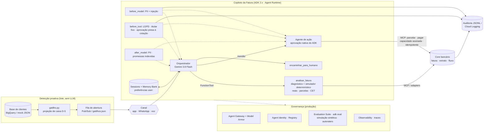

# Arquitetura — Copiloto da Fatura

## Fluxo de uma conversa
1. Gatilho abre a conversa no canal preferido com o valor que falta e a economia.
2. Orquestrador identifica o cliente (`iniciar_atendimento`) e fixa o titular na sessão (LGPD).
   Em produção o `cliente_id` chega autenticado no `state`; nenhuma tool recebe cliente do modelo.
3. `analisar_fatura` (código, sem LLM) devolve diagnóstico compacto e as 3 opções a apresentar, já em reais.
4. Orquestrador explica as opções e o custo de não fazer nada (rotativo).
5. Cliente escolhe → agente de ação chama a tool → o ADK pausa e mostra a cotação calculada em código →
   cliente aprova → host assina a capacidade → core confere e recalcula a cotação → executa → comprovante.
   Detalhes e limites em `docs/rai.md`.
6. Preferência registrada para o próximo mês; tudo auditado.

## Mapa para a rubrica (50%)
| Item da banca | Onde está |
|---|---|
| Orquestração entre modelos, contexto e lógica | `agent.py`, `simulador.py` |
| Multiagentes / módulos especializados | orquestrador e agente de ação; diagnóstico e simulador em código |
| Histórico, contexto e memória | `contexto.py` (state `user:`), Sessions/Memory Bank |
| Conexão com core, fatura, crédito | `mock_core/` + MCP |
| LGPD, privacidade, guardrails | `guardrails.py`, `autorizacao.py`, `docs/rai.md`, Model Armor |
| Medir sucesso, testar hipóteses | `eval/`, `tests/`, A/B no entregável 1 |
| Performance, latência, escala | Flash, gatilho em lote, Agent Runtime |

## FinOps de tokens
- LLM só onde há conversa e decisão. Diagnóstico, simulação e gatilho proativo são código.
- Retornos de tool compactos (~2 KB): eles voltam ao modelo em todo turno seguinte.
- Raciocínio em nível baixo por padrão (`COPILOTO_THINKING`); modelo lite possível no agente de ação.
- Testes sem LLM (`pytest`, inclusive o fluxo de aprovação com um LLM roteirizado); eval com juiz de 1 amostra.

## Ecossistema Google Cloud (GCP)
O projeto conta com adaptadores de nível de produção com fallback automático para execução offline:
- **Cloud Run / Agent Engine:** Deploy em container multi-stage (`Dockerfile`, `scripts/deploy_cloud_run.sh`).
- **Cloud DLP (Sensitive Data Protection):** Inspeção de PII gerenciada integrada aos guardrails (`copiloto_fatura/dlp_adapter.py`), ativada com `COPILOTO_USE_CLOUD_DLP=1`.
- **BigQuery:** Carga, consolidação e consulta de clientes e faturas em lote a partir da tabela oficial `hackathon_dados.extrato_sintetico` (`scripts/carregar_dados_extrato_sintetico.py` e `proativo/gcp_adapters.py`), ativada com `COPILOTO_USE_BIGQUERY=1`. Detalhes em [`docs/analise_dados_extrato_sintetico.md`](analise_dados_extrato_sintetico.md).
- **Secret Manager:** Gestão nativa de segredos criptográficos de autorização (`COPILOTO_AUTH_SECRET`), injetados diretamente na memória do container no Cloud Run sem persistência em disco.

