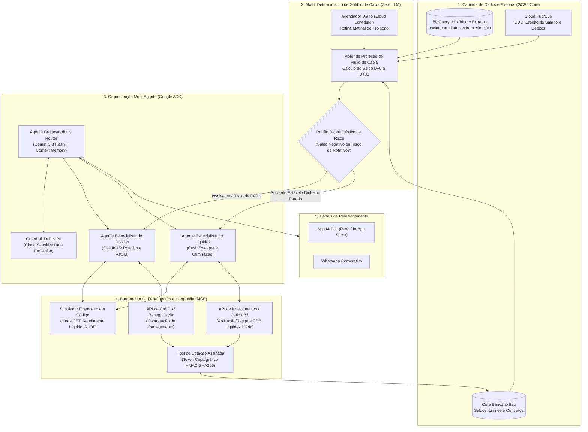

# Arquitetura e Especificação Técnica: Agente Autônomo de Gestão de Caixa e Otimização de Liquidez (Cash & Liquidity Sweeper)

> **Batalha de Agentes Itaú + Google** | Projeto: `batalha-time-09-nciv`  
> Documento técnico e de negócio orientado aos dados reais da tabela `hackathon_dados.extrato_sintetico` (467.585 transações, 1.000 clientes correntistas).

---

## 1. Sumário Executivo e Diagnóstico dos Dados Reais

### 1.1 A Realidade Factual da Base
A análise empírica dos 1.000 clientes da base de extratos revela uma assimetria estrutural profunda, dividindo a base em dois grupos com necessidades diametralmente opostas:

```
[=============================== BASE DE 1.000 CLIENTES ===============================]
|--- 493 Clientes em Déficit Crônico (49,3%) ---|--- 507 Clientes Superavitários (50,7%) ---|
| • Gastam R$ 9.190 para renda de R$ 7.454      | • 298 clientes com > R$ 20.000 parados     |
| • 68,9% rolaram rotativo a 436% a.a. em 2025  | • R$ 13,48 milhões dormindo na conta a 0%  |
| • R$ 541 mil pagos em juros de conta          | • R$ 8,75 milhões no top 298 correntistas   |
| • Dor: Sufocamento por dívida e contas fixas  | • Dor: Custo de oportunidade e inércia     |
```

### 1.2 Por que um "Robo-Advisor Tradicional de Investimento" Falha
1. **Inviabilidade para metade da base**: Para 49,3% dos clientes, qualquer oferta de aplicação financeira é uma aberração matemática e ética. O correntista paga **15% ao mês (436% ao ano)** no rotativo e **8% ao mês** no cheque especial. Oferecer um CDB que rende **0,9% ao mês (11% ao ano)** para quem está endividado destrói a confiança no banco e viola as normas de *Suitability* (Resolução CVM 30 e Resolução CMN 4.949).
2. **Inflexibilidade dos clientes superavitários**: 70% dos clientes da base possuem contratos rígidos de **Financiamento Imobiliário** (débito de R$ 2.845 no dia 8 do mês) e **Mensalidade Escolar** (débito de R$ 1.032). Se o produto travar o capital em ativos sem liquidez imediata, o cliente terá sua conta corrente estourada na primeira semana do mês.

### 1.3 A Tese da Solução: O Agente Bifásico de Caixa
A solução técnica viável é um **Orquestrador Autônomo de Liquidez** com duas esteiras especializadas:
* **Esteira de Passivos (Debt Relief)**: Detecta o risco de déficit antes do vencimento da fatura e estanca o rotativo e o cheque especial.
* **Esteira de Liquidez (Cash Sweeping & Otimização)**: Identifica o capital ocioso (os R$ 13,5M parados), calcula a margem de segurança para despesas contratuais e aplica o excedente em CDB de liquidez diária com resgate automático programado.

---

## 2. Princípios Arquiteturais e Guardrails de Risco Bancário

1. **Separação Rígida entre Cognição e Decisão**:
   * O **LLM (Gemini 1.5/Flash)** é restrito à interface conversacional, empatia, estruturação de argumentos e coleta de intenções.
   * O **Portão de Risco (Risk Gate)** e os **Cálculos Financeiros** são 100% determinísticos em código Python/SQL.
2. **Suitability Dinâmico em Tempo de Execução**:
   * O agente não confia apenas em um questionário estático de suitability. A elegibilidade para investimento é validada em tempo real contra o saldo projetado, o histórico recente de faturas e o endividamento.
3. **Trava Transacional de Duas Fases (2-Phase Commit com Cotação Assinada)**:
   * Nenhuma movimentação de dinheiro (aplicação, resgate ou parcelamento) ocorre sem um token de cotação criptograficamente assinado pelo host e com aprovação expressa do usuário na interface.
4. **Idempotência e Auditoria Imutável**:
   * Cada intenção e execução gera um UUID persistido em log auditável no BigQuery e Cloud Logging, garantindo rastreabilidade perante auditoria interna e órgãos reguladores.

---

## 3. Visão Geral da Arquitetura do Sistema



---

## 4. Detalhamento dos Componentes

### 4.1 Camada 1: Motor Preditivo de Fluxo de Caixa e Calendário

O motor opera monitorando os eventos identificados no extrato:
* **Entradas de Salário CLT**: 88% do volume cai entre os dias 5 e 7 do mês.
* **Débito de Financiamento Habitacional**: 8.400 lançamentos no dia 8 (ticket médio: R$ 2.845).
* **Débitos de Contas Fixas**: Condomínio e escola entre dias 10 e 14.
* **Vencimentos de Cartão**: Dias 15, 20, 25 e 30.
* **Débito de Juros e Encargos**: Dia 28 do mês.

#### O Algoritmo do Colchão Dinâmico de Segurança ($C_{seg}$)
Para evitar que uma aplicação de investimento deixe a conta a descoberto nos dias 8 e 20:

$$\text{Saldo Livre Projetado } (S_{livre}) = S_{atual} + \sum E_{previstas}(t \le 30) - \sum D_{contratuais}(t \le 30) - M_{seguranca}$$

Onde:
* $S_{atual}$: Saldo disponível em conta corrente.
* $E_{previstas}$: Salários e rendimentos recorrentes esperados.
* $D_{contratuais}$: Financiamento habitacional, mensalidade escolar, condomínio e fatura já fechada.
* $M_{seguranca}$: Margem estatística para despesas diárias (supermercado, combustível, farmácia), calibrada pelo percentil 75 do gasto dos últimos 90 dias.

---

### 4.2 Camada 2: O Portão Determinístico de Risco (Risk Gate)

Este componente é executado **antes** de qualquer inicialização de agente generativo:

```python
def classificar_regime_cliente(cliente_extrato: dict) -> RegimeCliente:
    # 1. Checagem de Restrições Críticas (Hard Locks)
    if cliente_extrato["saldo_atual"] < 0:
        return RegimeCliente.PASSIVO_EMERGENCIAL
    
    if cliente_extrato["faturas_rotativo_ultimos_90d"] > 0:
        return RegimeCliente.PASSIVO_PREVENTIVO
    
    saldo_livre_30d = calcular_saldo_livre(cliente_extrato)
    if saldo_livre_30d < 0:
        return RegimeCliente.PASSIVO_RISCO_CAIXA
        
    # 2. Checagem de Oportunidade de Liquidez (Cash Sweeping)
    if saldo_livre_30d >= 2000.0 and cliente_extrato["saldo_atual"] >= 5000.0:
        return RegimeCliente.INVESTIMENTO_CASH_SWEEPING
        
    return RegimeCliente.MANUTENCAO_NEUTRA
```

---

### 4.3 Camada 3: Orquestração Multi-Agente (ADK)

#### Agente Especialista 1: Otimizador de Liquidez (Cash Sweeper)
* **Objetivo**: Ativar os R$ 13,48 milhões ociosos da base.
* **Comportamento**:
  1. Identifica que o correntista possui saldo ocioso superior ao colchão do mês.
  2. Formula a proposta: *"Identifiquei que R$ 8.000 da sua conta não serão utilizados antes do dia 25. Sugiro aplicar no CDB de Liquidez Diária, que rende 100% do CDI com garantia do FGC."*
  3. **Gatilho de Auto-Unwind (Resgate Automático Programado)**: O agente cadastra no Core Bancário o resgate automático para D-1 do débito do financiamento ou fatura, garantindo risco zero de inadimplência.

#### Agente Especialista 2: Gestor de Passivos (Debt Relief)
* **Objetivo**: Estancar a sangria de 68,9% da base que recorre ao rotativo.
* **Comportamento**:
  1. Identifica o déficit de caixa D-5 antes do vencimento da fatura.
  2. Demonstra o custo real da inércia: *"Se pagar o mínimo de R$ 250, a fatura rolará no rotativo a 15% ao mês, custando R$ X de juros. Se parcelar em 6x fixas, você economiza R$ Y."*
  3. Executa a contratação do parcelamento ou encaminha para especialista humano quando o endividamento ultrapassa a capacidade de pagamento.

---

### 4.4 Camada 4: Mecanismo de Execução Segura (2-Phase Commit com Cotação Assinada)

Para garantir segurança jurídica, financeira e conformidade com o Banco Central:

```
[Cliente no App]                [Agente ADK]               [Host / Core Bancário]
       │                              │                              │
       │ 1. "Quero aplicar R$ 5.000"  │                              │
       ──────────────────────────────>│                              │
       │                              │ 2. Solicita cotação e token  │
       │                              ──────────────────────────────>│
       │                              │                              │
       │                              │ 3. Retorna Token HMAC-SHA256 │
       │                              │    (Valor: 5000, Expira: 15m)│
       │                              │<─────────────────────────────│
       │ 4. Apresenta Modal de Ação   │                              │
       │    com Botão de Confirmação  │                              │
       │<─────────────────────────────│                              │
       │                              │                              │
       │ 5. Cliente clica em "APROVAR"│                              │
       ──────────────────────────────>│                              │
       │                              │ 6. Envia Execução + Token    │
       │                              ──────────────────────────────>│
       │                              │                              │ Valida Token,
       │                              │                              │ Saldo e Assinatura
       │                              │                              │ Executa no Core
       │                              │ 7. Comprovante Autenticado   │
       │<────────────────────────────────────────────────────────────│
```

---

## 5. Matriz de Segurança, Privacidade (LGPD) e Conformidade Regulatória

| Requisito Regulatório | Órgão / Norma | Como a Arquitetura Garante |
| :--- | :--- | :--- |
| **Suitability Dinâmico** | CVM Resolução 30 | O Portão de Risco bloqueia deterministicamente ofertas de investimento para clientes com saldo devedor ou histórico recente de rotativo. |
| **Transparência de CET** | Bacen Res. 3.919 | Toda proposta de parcelamento exibe o Custo Efetivo Total (CET), taxa mensal e juros totais em reais calculados por código auditável. |
| **Proteção de Dados Pessoais** | LGPD (Lei 13.709) | Cloud DLP intercepta e mascara CPFs, números de agência, conta e cartão antes de qualquer payload ser entregue ao modelo de linguagem. |
| **Idempotência Transacional** | Padrão Bancário ISO 20022 | Cada requisição transacional carrega um `idempotency_key` único derivado do token de cotação para prevenir débitos ou aplicações duplicadas. |
| **Auditoria e Não-Repúdio** | Bacen Res. 4.893 | Tabela de auditoria em BigQuery em formato append-only registrando timestamp UTC, hash da mensagem, ID da sessão e resposta do core. |

---

## 6. FinOps e Estratégia de Custos de Computação

* **Gatilho Proativo sem Custo de LLM**: A rotina de varredura roda em lote via Cloud Run Jobs consultando o BigQuery, consumindo centavos de dólar por milhão de linhas analisadas.
* **Chamada de LLM sob Demanda**: O modelo de linguagem só é instanciado no momento em que o cliente abre a notificação ou inicia a interação.
* **Modelo Flash para Orquestração**: Utilização do **Gemini 1.5 Flash** para roteamento e formatação de mensagens, reservando modelos maiores exclusivamente para casos complexos de renegociação multi-dívida.
* **Payloads Otimizados**: As ferramentas retornam resumos estruturados com menos de 1,5 KB, minimizando a contagem de tokens de contexto em turnos subsequentes.

---

## 7. Indicadores e KPIs de Sucesso do Produto

### Para a Esteira de Liquidez (Investimentos):
1. **Volume Captado (AuM - Assets under Management)**: Meta de converter 30% dos R$ 13,48 milhões parados na conta em CDB/Tesouro Selic no primeiro trimestre.
2. **Taxa de Sucesso do Auto-Unwind (Resgate Programado)**: 100% de sucesso nos resgates em D-1, garantindo zero ocorrências de cheque especial causadas por aplicações do agente.
3. **Receita de Spread / Distribuição**: Incremento da margem financeira líquida gerada pela captação de recursos ociosos.

### Para a Esteira de Passivos (Dívidas):
1. **Redução de Rolagem no Rotativo**: Queda de 25% na quantidade de pagamentos mínimos e parciais da base tratada.
2. **Juros Evitados pelos Correntistas**: Métrica de impacto social e valor ao cliente (soma de `economia_vs_rotativo`).
3. **Redução da Provisão para Devedores Duvidosos (PDD)**: Mitigação do risco de inadimplência crônica de 65,9% típica do rotativo de cartão de crédito.
