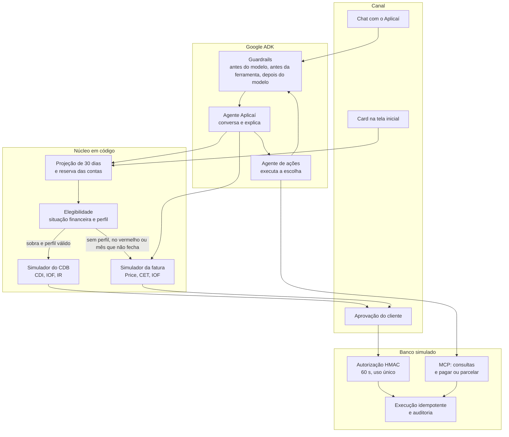

# Desenho de solução — Aplicaí

> Entregável de arquitetura, engenharia e ciência de dados. Diagrama abaixo (Mermaid, equivalente ao que se desenha no Gliffy). Cada bloco existe no código, salvo o que está marcado como evolução.

## 1. Arquitetura do agente e uso de IA

Dois agentes no Google ADK 2.x, os dois com Gemini 3.8 Flash (`COPILOTO_MODEL`; `demo` troca o modelo por um roteiro sem internet, só na jornada da fatura):

- **Aplicaí** (`copiloto_fatura/agent.py`): conversa, escolhe a ferramenta e explica os números. Não calcula.
- **Agente de ações**: só executa o que o cliente escolheu (pagar, parcelar, aplicar ou resgatar) e devolve a conversa.

O diagnóstico não é um terceiro modelo. Projeção de 30 dias, regras de elegibilidade e os dois simuladores (fatura e CDB) são código Python. O modelo entra onde há linguagem; a conta fica fora dele. Raciocínio do Gemini em nível baixo por padrão, para não gastar cota com tokens de thinking.

A tela inicial não espera o chat. `web/servidor.py` chama o mesmo núcleo e monta um card: aplicar a sobra, pedir o perfil de investidor, acolher quem está no vermelho ou mostrar a fatura. O chat abre sob demanda.

## 2. Contexto, memória e integrações

**Contexto que o modelo recebe:** primeiro nome, fatura, saldo previsto, opções já em reais, reserva das contas, sobra e se a oferta de CDB está liberada. Idade, score, negativação e histórico de rotativo ficam no banco e entram só nas regras, não no texto do modelo.

**Memória:** estado da sessão do ADK. Preferências com lista fechada de chaves (`registrar_preferencia`). Acessibilidade só depois de consentimento. Memory Bank e Agent Engine são evolução: no protótipo a sessão vive no processo.

**Integrações:**

| Peça | Papel | Onde |
|---|---|---|
| Banco simulado | Saldos, fatura, CDB, idempotência, auditoria JSONL | `mock_core/store.py` |
| API do app | Card, aplicação, resgate e parcelamento com autorização assinada | `web/servidor.py` |
| MCP | Consultas (perfil, fatura, extrato, fluxo) e operações da fatura (pagar, parcelar), com a mesma autorização conferida do outro lado | `mock_core/server.py` |
| BigQuery | Base do evento (1.000 clientes, 467.585 transações). Análise e carga opcionais; sem credencial, o app usa `data/clientes.json` | `proativo/gcp_adapters.py` |
| Pub/Sub | Fila dos avisos de fatura, se o tópico existir | `proativo/gatilho.py` |
| Secret Manager / Cloud DLP | Chave HMAC e máscara extra de dados pessoais. Sem eles, a chave é local e a máscara é regex | `scripts/deploy_cloud_run.sh`, `dlp_adapter.py` |

Aplicar e resgatar o CDB passam pelo núcleo e pelo banco no app e nas ferramentas diretas do agente. O servidor MCP desta versão publica as consultas e as operações da fatura.

## 3. Segurança, dados e experimentação

**LGPD.** CPF, cartão, telefone, e-mail e endereço são mascarados antes do modelo. Um cliente por sessão: pedido sobre outra pessoa é bloqueado e auditado. Aviso proativo respeita oposição na hora e toda mensagem diz como parar.

**Guardrails, nos dois agentes.** Antes do modelo: máscara e bloqueio de manipulação, sem chamar o Gemini. Antes da ferramenta: titular da sessão, cotação calculada em código e aprovação fora do texto (escrever "sim" não executa). Na execução: HMAC-SHA256, 60 segundos, uso único; o banco confere a assinatura e refaz a cotação. Depois do modelo: promessa de crédito e resposta discriminatória são trocadas por uma resposta segura.

**Política de investimento, dentro da cotação.** Saldo negativo, déficit crítico, falta de dinheiro para as contas do mês, sobra abaixo do mínimo ou perfil de investidor ausente ou vencido: a cotação falha e nada é assinado. O valor aplicado não passa da sobra. O único produto é o CDB de liquidez diária, 100% do CDI, com FGC.

**Dados.** A tese usa a base do evento (507 clientes ganham mais do que gastam, 493 gastam mais, 327 entraram no cheque especial). A demo roda em 200 clientes sintéticos, com cinco personas fixas: Diego (sobra e perfil válido), Elaine (sobra sem perfil), Carla (conta negativa), Ana (fatura que não fecha) e Bruno.

**Como se mede.** 156 testes sem internet cobrem simulador, portão, autorização e os cards. A avaliação com o Gemini (`eval/`) tem 12 de 12 na jornada da fatura, inclusive injeção, dado de terceiro e equidade; não há caso de avaliação da aplicação. No piloto, a métrica principal é zero cliente que aplicou e ficou sem saldo para uma conta nos 30 dias seguintes.

## 4. Diagrama

Quatro saídas da mesma projeção:

1. **Diego.** Reserva de R$ 9.700, sobra de R$ 28.550, perfil válido: card para aplicar no CDB. A cotação recalcula o limite; acima da sobra, recusa.
2. **Elaine.** Sobra de R$ 17.150 e perfil ausente: card pede a atualização. A execução também recusa.
3. **Carla.** Saldo negativo: sem oferta de investimento; acolhimento e encaminhamento humano simulado.
4. **Ana.** Fatura de R$ 1.850 e R$ 610 na conta: no chat, o simulador recomenda pagar R$ 549 agora e parcelar o resto em 6x de R$ 294,04. Cada passo tem a própria aprovação.

A rotina `proativo/gatilho.py` varre a base sem modelo e avisa quem não cobre a fatura na janela de dias. Quem tem sobra, como o Diego, vê o card ao abrir o app; não entra nessa fila.
